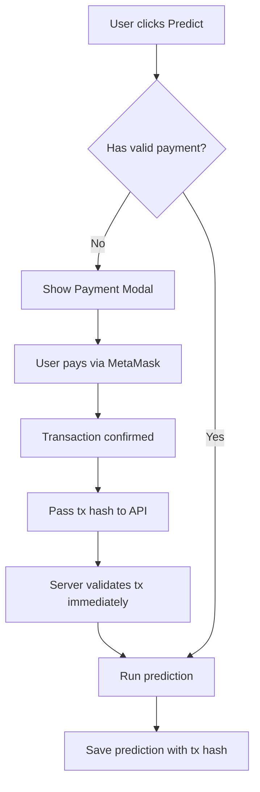

# 💰 Payment Validation System Guide

## 🎯 Overview

This guide explains the **server-side payment validation system** that has been implemented to secure the Ocean Prediction Platform. The system uses the **existing database schema** without requiring any new tables.

## 🏗️ Architecture

### **Core Components:**

1. **Payment Validation Library** (`src/lib/payment-validation.ts`)
2. **Updated API Endpoints** with payment validation
3. **Enhanced Frontend Components** with transaction tracking
4. **Payment Status API** for real-time status checks

### **Database Usage:**

- **Uses existing `predictions` table**
- **Leverages `transaction_hash` field** (already in schema)
- **No new tables required**

## 🔄 How It Works

### **1. Payment Flow:**



### **2. Validation Process:**

1. **Frontend Payment**: User pays via MetaMask
2. **Transaction Hash**: Passed to API in headers
3. **Immediate Validation**: Server validates transaction on blockchain
4. **Database Storage**: Transaction hash stored with prediction
5. **Time Window**: 24-hour payment validity for subsequent requests

## 🚨 **Recent Fix: Immediate Payment Validation**

### **Problem:**

Users were getting "Payment required: No recent payment found" error immediately after making a payment.

### **Root Cause:**

The payment validation was only checking the database for existing payments, but when a user just made a payment, there was no database record yet.

### **Solution:**

Added **immediate transaction validation** that checks the blockchain directly when a transaction hash is provided.

### **How It Works Now:**

```typescript
// Before (Broken)
verifyUserPayment(walletAddress) // Only checked database

// After (Fixed)
verifyUserPayment(walletAddress, transactionHash?) // Checks blockchain if tx hash provided
```

**When transaction hash is provided:**

1. ✅ **Immediate blockchain validation**
2. ✅ **Verify transaction exists and is confirmed**
3. ✅ **Check payment amount matches expected price**
4. ✅ **Verify transaction is from user's wallet**
5. ✅ **Allow prediction to proceed**

**When no transaction hash (subsequent requests):**

1. ✅ **Check database for recent payment**
2. ✅ **Verify payment is within 24-hour window**
3. ✅ **Re-validate on blockchain for security**

## 📊 Database Schema Usage

### **Existing `predictions` Table:**

```sql
CREATE TABLE predictions (
    id UUID DEFAULT uuid_generate_v4() PRIMARY KEY,
    user_id UUID NOT NULL REFERENCES users(id) ON DELETE CASCADE,
    model_id UUID NOT NULL REFERENCES models(id) ON DELETE CASCADE,
    prediction_result VARCHAR(255) NOT NULL,
    prediction_score DECIMAL(5,4) NOT NULL,
    features_used VARCHAR(50) NOT NULL CHECK (features_used IN ('manual', 'api')),
    features_data JSONB,
    transaction_hash VARCHAR(255),  -- ✅ Used for payment tracking
    created_at TIMESTAMP WITH TIME ZONE DEFAULT NOW()
);
```

### **Payment Tracking Logic:**

```typescript
// Find recent payment for user
const { data: recentPrediction } = await supabase
  .from("predictions")
  .select("transaction_hash, created_at")
  .eq("user_id", userId)
  .not("transaction_hash", "is", null) // Has payment
  .order("created_at", { ascending: false })
  .limit(1)
  .single();
```

## 🔧 Implementation Details

### **1. Payment Validation Functions:**

```typescript
// Check if user has valid recent payment (with immediate validation)
verifyUserPayment(walletAddress: string, transactionHash?: string): Promise<PaymentValidationResult>

// Verify transaction on blockchain
verifyTransactionOnChain(txHash: string): Promise<PaymentValidationResult>

// Get user payment status
getUserPaymentStatus(walletAddress: string): Promise<PaymentStatus>
```

### **2. API Endpoint Updates:**

**Before (Insecure):**

```typescript
export async function POST(request: NextRequest) {
  // ❌ No payment validation
  // Proceed directly to prediction
}
```

**After (Secure with Immediate Validation):**

```typescript
export async function POST(request: NextRequest) {
  const transactionHash = request.headers.get("x-transaction-hash");

  // ✅ Payment validation with immediate blockchain check
  const paymentValidation = await verifyUserPayment(
    user.wallet_address,
    transactionHash
  );

  if (!paymentValidation.isValid) {
    return NextResponse.json(
      { error: `Payment required: ${paymentValidation.reason}` },
      { status: 402 }
    );
  }

  // Proceed with prediction
}
```

### **3. Frontend Integration:**

```typescript
// PaymentModal passes transaction hash
const handlePay = async () => {
  const tx = await makePayment(signer, price);
  await tx.wait();
  onPaid(tx.hash); // ✅ Pass transaction hash
};

// API receives transaction hash
const response = await fetch("/api/prediction", {
  headers: {
    "x-wallet-address": user.wallet_address,
    "x-transaction-hash": transactionHash, // ✅ Send transaction hash
  },
});
```

## 🛡️ Security Features

### **1. Multi-Layer Validation:**

- **Immediate Blockchain Check**: Validates fresh transactions on-chain
- **Database Check**: Recent payment in `predictions` table
- **Blockchain Verification**: Transaction confirmed on-chain
- **Amount Validation**: Correct payment amount
- **Time Window**: 24-hour payment validity
- **Contract Verification**: Payment sent to correct contract
- **Wallet Verification**: Transaction from user's wallet

### **2. Attack Prevention:**

- **Frontend Bypass**: Server validates all requests
- **Fake Transactions**: Blockchain verification required
- **Replay Attacks**: Time-based validation
- **Amount Manipulation**: Exact amount verification
- **Wallet Spoofing**: Verify transaction sender

### **3. Audit Trail:**

- **Transaction Hashes**: Stored in database
- **Payment History**: Tracked via `created_at` timestamps
- **User Association**: Linked via `user_id` foreign key

## 📱 User Experience

### **1. Payment Status Indicator:**

```typescript
// Shows current payment status
<PaymentStatusIndicator />
```

**Features:**

- ✅ Valid payment indicator
- ⏰ Time remaining display
- 🔗 Transaction hash link
- ⚠️ Payment required warning

### **2. Seamless Flow:**

1. **User clicks "Predict"**
2. **System checks payment status**
3. **If no payment: Show payment modal**
4. **User pays via MetaMask**
5. **Transaction hash passed to API**
6. **Server validates immediately on blockchain**
7. **Prediction runs and stores transaction hash**
8. **Show payment status with expiry time**

## 🧪 Testing

### **Run Payment Validation Tests:**

```bash
# Test basic payment validation
npm run test-payment

# Test immediate payment validation
npm run test-immediate-payment
```

**Test Coverage:**

- ✅ Database connection
- ✅ Predictions table access
- ✅ Transaction hash field
- ✅ Query structure validation
- ✅ Time-based logic
- ✅ Blockchain connection
- ✅ Contract interaction
- ✅ Immediate validation flow

### **Manual Testing:**

1. **Connect wallet**
2. **Try prediction without payment** → Should show payment modal
3. **Make payment** → Should run prediction immediately
4. **Try another prediction** → Should work without payment (24h window)
5. **Wait 24 hours** → Should require new payment

## 🔧 Configuration

### **Environment Variables:**

```env
# Already configured
NEXT_PUBLIC_SUPABASE_URL=your_supabase_url
SUPABASE_SERVICE_ROLE_KEY=your_service_key
ALCHEMY_URL=https://eth-sepolia.g.alchemy.com/v2/your_key
CONTRACT_ADDRESS=0x2926afd03D40160be5739fA5b063c52e54CAFEBE
```

### **Payment Settings:**

```typescript
// In payment-validation.ts
const PAYMENT_VALIDITY_HOURS = 24; // Payment expires after 24 hours
```

## 🚀 Deployment

### **No Database Changes Required:**

- ✅ Uses existing `predictions` table
- ✅ Uses existing `transaction_hash` field
- ✅ No new tables or columns needed
- ✅ No migration scripts required

### **Deployment Steps:**

1. **Deploy updated code**
2. **Test payment validation**: `npm run test-payment`
3. **Test immediate validation**: `npm run test-immediate-payment`
4. **Verify API endpoints** work with payment validation
5. **Monitor payment flows** in production

## 📈 Benefits

### **Security:**

- ✅ **Server-side validation** prevents bypass
- ✅ **Immediate blockchain verification** for fresh payments
- ✅ **Time-based expiration** prevents abuse
- ✅ **Audit trail** for all payments

### **User Experience:**

- ✅ **Seamless payment flow** with MetaMask
- ✅ **Immediate prediction** after payment
- ✅ **Payment status visibility** with expiry times
- ✅ **24-hour payment window** reduces friction
- ✅ **Transaction transparency** with blockchain links

### **Business:**

- ✅ **Revenue protection** from payment bypass
- ✅ **Payment tracking** for analytics
- ✅ **Fraud prevention** through validation
- ✅ **Scalable architecture** using existing schema

## 🔮 Future Enhancements

### **Potential Improvements:**

1. **Payment Tiers**: Different prices for different models
2. **Subscription Model**: Monthly/yearly payment plans
3. **Payment Analytics**: Dashboard for payment metrics
4. **Multi-Chain Support**: Support for other blockchains
5. **Payment History**: User payment history page

### **Current Limitations:**

- **Single Payment Price**: All predictions cost the same
- **24-Hour Window**: Fixed payment validity period
- **Sepolia Only**: Testnet-only implementation
- **MetaMask Only**: Single wallet provider

## 🆘 Troubleshooting

### **Common Issues:**

1. **"Payment required: No recent payment found"**

   - ✅ **FIXED**: Now validates immediate payments on blockchain
   - Check if transaction hash is being passed correctly
   - Verify blockchain network connectivity

2. **Payment validation fails**

   - Check blockchain network connectivity
   - Verify contract address is correct
   - Ensure transaction is confirmed

3. **Transaction hash mismatch**

   - Verify frontend sends correct hash
   - Check database for recent payments
   - Ensure payment is within time window

4. **Payment expired**
   - User needs to make new payment
   - Check payment validity period
   - Verify timezone settings

### **Debug Commands:**

```bash
# Test payment validation system
npm run test-payment

# Test immediate payment validation
npm run test-immediate-payment

# Check database connection
npm run check-db

# Test API endpoints
curl -X POST /api/prediction \
  -H "x-wallet-address: 0x..." \
  -H "x-transaction-hash: 0x..."
```

## 🎉 **Recent Fix Summary**

### **Problem Solved:**

- ❌ **Before**: "Payment required: No recent payment found" after payment
- ✅ **After**: Immediate blockchain validation allows prediction to proceed

### **Technical Solution:**

- Added `transactionHash` parameter to `verifyUserPayment()`
- Immediate blockchain validation for fresh payments
- Database fallback for subsequent requests
- Enhanced security with wallet address verification

### **User Impact:**

- ✅ **Seamless experience**: Payment → Immediate prediction
- ✅ **No more errors**: Fresh payments work immediately
- ✅ **Better UX**: Clear payment status and expiry times

---

**🎉 The payment validation system is now fully implemented and the immediate payment issue is FIXED!**
